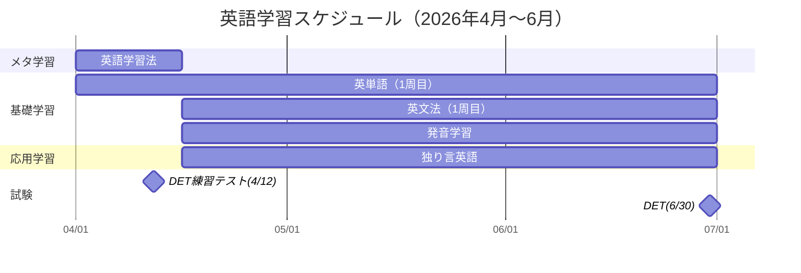

## はじめに

## 勉強開始前の英語レベル

TOEFLスコア → TOEICや英検換算で
Duolingo English Test で 65~85 が参考スコア
スピーキングできるフレーズを何個あk

## やったこと

### 使用教材

https://atsueigo.shop/products/%E8%8B%B1%E5%8D%98%E8%AA%9E%E5%AD%A6%E7%BF%92%E6%9C%AC-vocabularist

https://atsueigo.shop/collections/recommended-products/products/%E8%AB%96%E7%90%86%E7%9A%84%E3%81%AB%E8%8B%B1%E8%AA%9E%E3%82%92%E8%80%83%E3%81%88%E3%82%8B-%E8%8B%B1%E8%AA%9E%E5%AD%A6%E7%BF%92%E6%B3%95%E8%AC%9B%E5%BA%A7-%E5%8B%95%E7%94%BB%E8%AC%9B%E5%BA%A7

https://www.kadokawa.co.jp/product/321907000333/

https://www.kadokawa.co.jp/product/322110000608/

https://atsueigo.shop/collections/recommended-products/products/%E7%99%BA%E9%9F%B3%E3%83%9E%E3%82%B9%E3%82%BF%E3%83%BC%E3%82%AF%E3%83%A9%E3%82%B9-pronunciation-masterclass-%E5%8B%95%E7%94%BB%E8%AC%9B%E5%BA%A7

### 学習スケジュール

### 英語学習のための学習（メタ学習）

### 土台の準備（基礎学習）

### 英語脳を作るためのウォームアップ（応用学習）

### 成果の計測 （試験）

なぜTOEICやTOEFL、IELTを選択しなかったのか

## 3ヶ月で到達した英語レベル

## おわりに